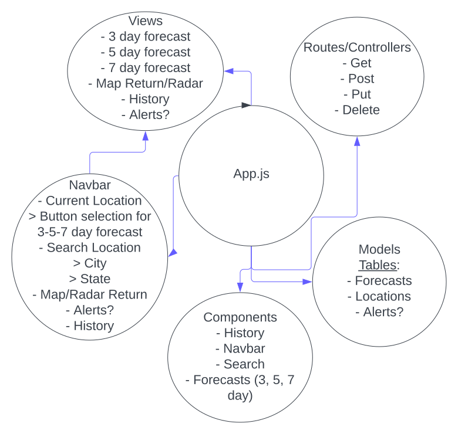

# Weather App

## Intended App flow Diagram



## App Summary

This project is a small app which presents a quick weather dashboard for your current location
(you will be prompted to share your location if you are using chrome or any other supported browser). In addition,
you can search for any location other than your own by latitude and longitude or by name examples:

`40.0850865,-104.9474874`

`Denver, CO.`

The app leverages the 'Visual Crossing Weather API,' https://www.visualcrossing.com/resources/documentation/weather-api/timeline-weather-api/ for queries.

There is a mongoDB backend still not fully-implemented for local storage, but it was used to debug storing the home location
(as a data point referenced), upon build out of the application. There is a complete CRUD built for the Locations with API routes as well.

Example object in Mongo:

```
{
  "_id": "62767e5bfcd289270db4069a",
  "latitude": 40.0850083,
  "longitude": -104.9475046,
  "type": "Point",
  "coordinates": [
    40.0850083,
    -104.9475046
  ],
  "name": "home",
  "__v": 0
}
```

We originally had plans to put together some features supporting retrieval of weather data stored and be able to compare with current
data; we just never had the time to build it and instead decided to leverage more with what the API provided already.


### API (Backend) Internal Routes
| Method |           Path           |                      Purpose                     |
|:------:|:------------------------:|:------------------------------------------------:|
|   GET  |             /            |                     Home Page                   |
|   GET  |        /api/location     |             Return all locations stored          |
|   GET  |     /api/location/:id    |                Return location by Id             |
|   GET  | /api/location/name/:name |               Return location by Name            |
|  POST  |       /api/location      |                Create new location               |
|   PUT  |     /api/location/:id    |             Update a location by Id              |
| DELETE |     /api/location/:id    |              Delete a location by Id             |


### API (Backend) External Routes to Visual Crossing
| Method |           Path           |                      Purpose                     |
|:------:|:---------------------------------:|:--------------------------------------------------------------------:|
|   GET  |   /api/external/forecast/:params  |  Get external forecast data based on time ranges, location, and auth |
|   GET  |   /api/external/current/:params   |  Get external current data based on time ranges, location, and auth  |
|   GET  |   /api/external/history/:params   |  Get external data based on time ranges, location, and auth          |


### Frontend Routes
| Method |           Path           |                      Purpose                     |
|:------:|:---------------------------------:|:--------------------------------------------------------------------:|
|   GET  |   /                               |  Weather App Home Page (Current conditions and 5-day forecast)       |
|   GET  |   /current                        |  Shows Current conditions                                            |
|   GET  |   /alerts                         |  Show any alerts in your current area                                |
|   GET  |   /history                        |  Show history for past 5-day forecast                                |
|   GET  |   /3day                           |  Show history for next 3-day forecast                                |
|   GET  |   /5day                           |  Show history for next 5-day forecast                                |
|   GET  |   /7day                           |  Show history for next 7-day forecast                                |
|   GET  |   /search                         |  Search current weather for input location                           |

## Deployed App Links

### API (backend):

https://weather-app-brs121.herokuapp.com/

### Frontend:

https://deploy-config--incomparable-sunshine-3576c1.netlify.app/

## Steps to start app for development

1.) cd into the `frontend` directory, create a `.env` file with the following:

`REACT_APP_WEATHER_APP_API_URL="http://localhost:5000"`

 Next, run the following commands:

`npm i`

`npm start`

2.) Open a new terminal and cd into the `backend` directory and do the following:

  a.) Create a `.env` file with the following:
  ```
  MONGODB_URL=mongodb://localhost/weather
  PORT=5000
  ```
  b.) Run the following commands (install `nodemon` if you haven't yet with `npm i nodemon`):

  `npm i`

  `nodemon app.js`

3.) Open your browser to visit the frontend with this address:

http://localhost:3000

You should see a page load with a navbar with options on top with this text on the page:

`Weather App`

4.) Open a new tab in your browser to visit the backend API:

http://localhost:5000

You should see this return in json:

```
{
"message": "API Success!"
}
```

## Steps to setup app for development

1.) cd into the `frontend` directory and setup a `.env` file with the following:

```
EXTERNAL_API_URL="https://weather.visualcrossing.com/VisualCrossingWebServices/rest"
API_KEY="<Key_You_Are_using>"
REACT_APP_WEATHER_APP_API_URL="http://localhost:5000"
BUILD_PATH=../backend/client/build
```

2.) Run the following under the `frontend` directory to build:

```
npm run build
```

3.) cd into the `backend` directory and setup a `.env` file with the following:

```
WEATHER_APP_API_URL="http://localhost:5000/api"
EXTERNAL_API_URL="https://weather.visualcrossing.com/VisualCrossingWebServices/rest"
MONGODB_URL="mongodb://localhost/weather"
API_KEY="<Key_You_Are_using>"
PORT=5000
```

3.) cd into the `backend` directory and setup the `package.json` with the following block for deployment:

```
"scripts": {
  "start": "NODE_ENV=production PORT=8000 serve -s client/build & node app.js"
},
```

4.) cd into the `backend` directory and run the following commands:

```
npm start
```

This should execute the app locally under a single directory (in this case, backend)
Additional steps will need to be performed for setting up the env vars for the deployment since
they should not be committed into git directly for use.